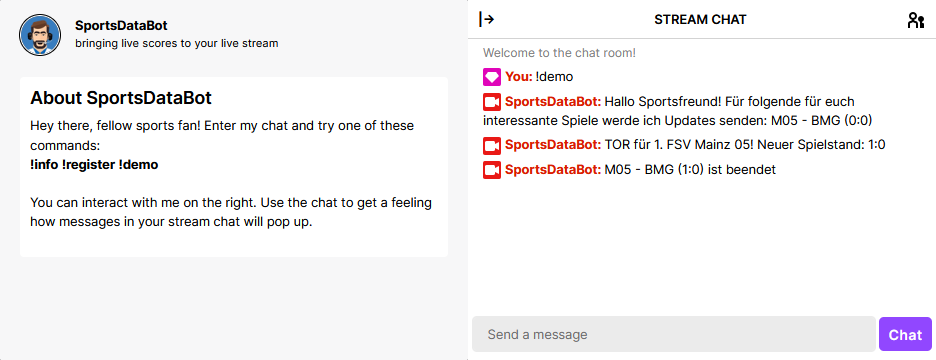
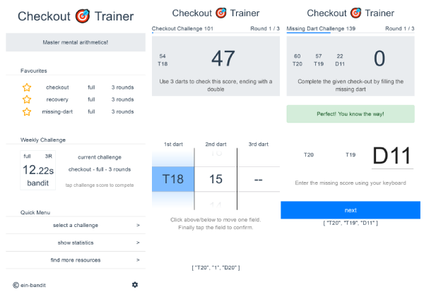
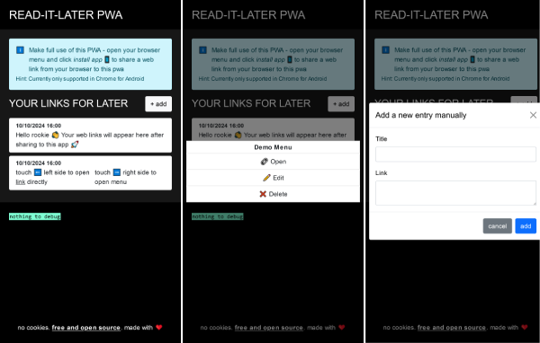
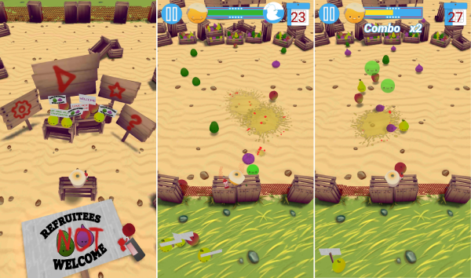

# closed-source-projects

list of private and closed-source projects of @kryptografisch

### SportsDataBot

twitch bot for football live scores - sends live scores to chat window of registered twitch channels 📹🎮

nuxt3, typescript, cloud hosting

service deployed and running | web platform development in progress

[sportsdatabot.eu](https://sportsdatabot.eu)

### checkout-trainer

web app for improving mental arithmetics for darts players 🎯

vue2, ui design, interaction design

current version as SPA available | reworking interaction concept | development of leaderboard server planned

[checkout-trainer @ heroku](http://checkout-trainer.herokuapp.com)

### read-it-later pwa

pwa for storing websites and online articles to read later 📓

plain html/css/js, pwa

current version as pwa available | extending app to use persistent storage browser API planned | cloud sync features planned

[ril @ web](https://ril.kryptografische.biz)

### Refruitees Welcome

unity3d game for android/mobile - in which you 🍊 need to defend your marketplace border by stopping "bad fruits" 🥑 from passing and letting "good fruits" 🍐 through

unity3d, REST database, crash/analytics

project finished | available as apk download

[Refruitees Welcome @ web](https://refruitees-welcome.kryptografische.biz)
